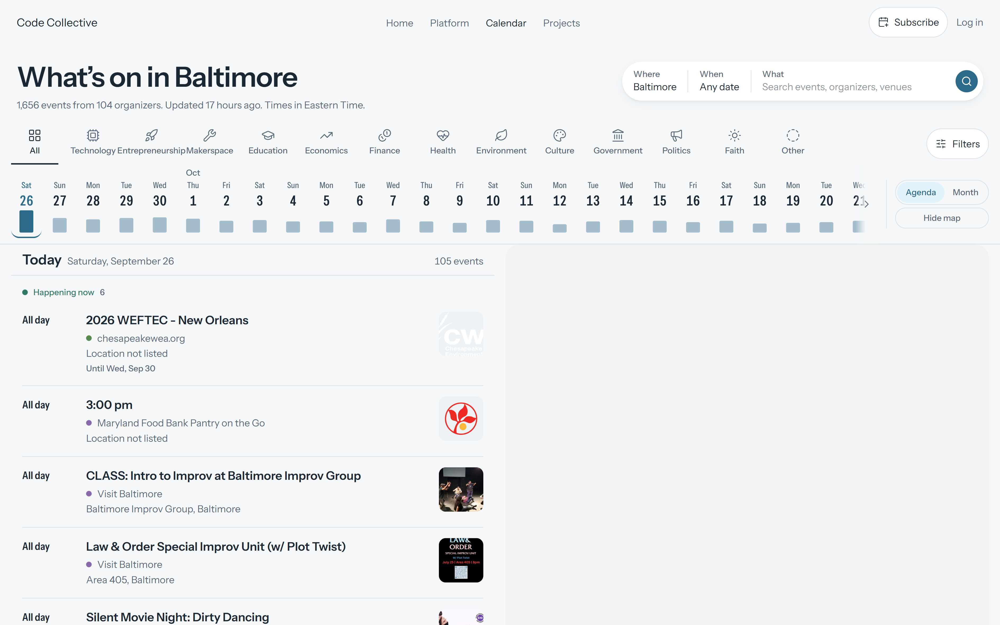

# Code Collective calendar, redesigned

A redesign of the [Code Collective](https://codecollective.us/calendar?city=baltimore)
events calendar as a calm, time-first agenda. It reads the same live public
event JSON the current site does, and changes nothing about the site itself.

The problem it solves: Baltimore runs 1,695 upcoming listings across 105
organizers, with 105 on the busiest Saturday alone. The current page shows them
in a month grid capped at three events per day, so most listings sit behind a
"+N" that a visitor has to go digging for. This version leads with time,
answers "what is on, when, and is it for me" in one screen, and never puts an
event somewhere you cannot reach it.



---

## Running it

```bash
npm install
npm run dev
```

Then open <http://localhost:5173/?city=baltimore>.

| Command | What it does |
|---|---|
| `npm run dev` | Vite dev server |
| `npm run build` | Typecheck, then a production build into `dist/` |
| `npm test` | 137 unit tests |
| `npm run test:e2e` | 42 Playwright tests, desktop and phone, including axe |
| `npm run typecheck` | TypeScript only |

Two environment variables, both optional:

- `VITE_DATA_SOURCE=live|snapshot` — `snapshot` reads the committed
  `public/snapshot/baltimore.json` so the app works with no network.
- `VITE_BASE` — the mount point for the build. `/` by default, `./` for a
  static host that needs relative URLs.

---

## How it fits together

```
 codecollective.us/<city>/upcoming_events.json        the only input
                    │
                    ▼
  fetchEvents.ts    one cached promise per city, read with React use()
                    │                     sessionStorage copy for the offline state
                    ▼
  normalize.ts      RawEvent → CalEvent
                    │  • occurrence-stable key
                    │  • zone-explicit times
                    │  • HTML entities decoded
                    │  • finished events dropped
                    ▼
  sectors.ts        tags → sectors, via the site's own category map
                    │
                    ▼
  pipeline.ts       one pass per filter change, producing
                    │  • the agenda's day sections
                    │  • the tide line's per-day counts
                    │  • the filters sheet's per-sector counts
                    │  • the map's placeable subset
                    │  • the empty state's relaxations
                    ▼
  App.tsx           agenda │ month │ map, all driven from the URL
```

The URL is the state. Everything a visitor might share — city, search, sectors,
dates, time of day, distance, lens, view, the open event — lives in the query
string, so any view can be linked, and every link the current site has ever
produced still resolves.

### Where things live

| Path | Responsibility |
|---|---|
| `src/data/` | Everything that is not React. Pure, unit-tested. |
| `src/state/urlState.ts` | nuqs parsers, and the mapping for the legacy parameters |
| `src/app/useCalendar.ts` | Joins the feed, the URL and the pipeline |
| `src/components/` | One folder per surface |
| `src/styles/tokens.css` | The Harbor palette, type scale and geometry |
| `public/snapshot/` | A committed copy of the live feed, for offline work and tests |

### What is deliberately lazy

Only the agenda is on the critical path. The map, the detail sheet, the filters
sheet, the subscribe dialog, the phone search sheet and the markdown renderer
are all separate chunks, fetched when they are first needed. Initial JavaScript
is **152 KB gzipped** against a 170 KB budget; MapLibre alone is 286 KB and
never loads unless the map is shown.

---

## The design

The identity is Baltimore's harbor: marble-stoop white, tidewater blue,
harbor-night navy. Calm and cool, with the boldness spent in one place.

**The tide line** is that place. A strip of the next 60 days whose bars rise and
fall with how busy each day is, like a tide chart. Bar height is
`4 + 28 × √(count ÷ max)`; the square root is load-bearing, because a 105-event
Saturday against a 15-event Tuesday flattens every other day on a linear scale.
The bars follow the current filters, so choosing Technology redraws the whole
coastline.

Everything else stays quiet. Rows are time-first rather than image-first,
because an event is chosen by when it happens, not by how it looks. Sector
colour appears only as an 8px dot, a chip, or a map point — never as a filled
event block. The palette is generated in OKLCH at equal lightness and chroma so
no sector shouts louder than another, which replaces a live category map that
currently ships pure black for Faith, pure white for Economics, and two
near-identical blues for Technology and Education.

Type is one superfamily, Instrument Sans Variable, used across two axes: the
width axis carries dense date and time data at 75–85%, and normal width carries
reading text. Every date, time and count is tabular.

---

## What the data actually looks like

Profiled from the live Baltimore feed on 25 September 2026, and re-asserted on
every test run in `src/data/snapshot.test.ts`.

| | |
|---|---|
| Upcoming events | 1,695 |
| Organizers | 105 |
| Busiest day | 105, Saturday 26 September |
| With coordinates | 798 (47%) |
| With an image | 1,159 (68%) |
| No end time | 387 |
| Cancelled | 3 |
| Tags mapping to Technology | 73 (4%) |

Four things in that feed are not obvious, and each one changed the code:

**`startDate` is almost always UTC.** 1,642 of 1,695 rows carry a `+00:00`
offset. Spot-checking rows against clock times written in their own
descriptions confirms the instants are right and the offset is real, so a
midnight-UTC row is an 8 p.m. show the evening before — 138 rows look like that.
Every date decision is therefore zone-explicit, and nothing reads the machine's
local zone.

**The upstream `id` is not per-occurrence.** Eighteen `time.ly` ids are reused
across every date of a recurring series, one of them across 23 dates. Keying on
the id alone silently merged 161 real events out of the calendar. The key now
always folds the start in.

**`scrapeTime` arrives in four shapes**, and 1,422 rows carry no UTC offset at
all. `new Date()` hands those to implementation-specific parsing, which resolves
them in the viewer's own zone, so "Updated 3 hours ago" would have read
differently in Denver than in Baltimore. They are parsed in the scrapers' zone.

**Plain text arrives HTML-encoded.** Fifteen titles and ten location fields
carry things like `&#038;` and `&#8217;`, which rendered literally.

Technology being 4% of the listings is why the sector rail is ordered
mission-first rather than by volume: it is why someone opens a calendar branded
for technologists, and sorting by count would bury it below Culture's 824.

---

## Accessibility

Targets WCAG 2.2 AA, verified rather than asserted. `npm run test:e2e` runs axe
over the agenda, the month grid, the open detail sheet, the open filters sheet
and the map, in both themes, on desktop and phone, and fails the build on any
serious or critical violation. Lighthouse reports **100 for accessibility** on
both profiles.

The list is the accessible equivalent of the map. Every event is a real anchor
with a visible focus ring, the tide line is a roving-tabindex toolbar with arrow
key support, the month grid is a real `role="grid"`, selection is announced, and
a focused row is never hidden under the sticky chrome — there is a test for that
specifically.

Three defects the audit caught that reading the code would not have:

- An unlayered `button { padding: 0 }` reset was silently beating every Tailwind
  `px-*` utility, collapsing the padding on **every button in the app**. The
  Filters control measured 16px wide. Resets now live in `@layer base`.
- Buttons whose labels are hidden on narrow screens had no accessible name at
  all.
- The cancelled-row treatment the brief describes, 60% opacity, takes muted ink
  to 3.3:1. Cancelled listings are struck through and badged instead.

---

## Performance

Lighthouse against a production build:

| | Desktop | Mobile |
|---|---|---|
| Performance | 97 | 83 |
| Accessibility | 100 | 100 |
| LCP | 1.1s | 4.4s |
| CLS | 0 | 0 |
| Total blocking time | 0ms | 60ms |

Mobile LCP misses the 2.0s target, and the reason is structural rather than
fixable from here. Lighthouse's mobile profile applies a 4× CPU slowdown, and
the page has to fetch a 2.6 MB unpaginated feed (211 KB over the wire), parse
it, and normalize 1,695 events before it can say how many there are. The
heading and the meta line are painted from static markup in `index.html` so
something real is on screen at 1.8s, and the first agenda batch was cut from 14
days to 3, which took blocking time from 270ms to 60ms and the DOM from 5,036
elements to 1,911. The remaining 2.6s is the feed.

The fix is an endpoint that returns a bounded window — the next 30 days rather
than the next 30 months — or a pre-aggregated per-day count. Both are backend
changes, which the brief puts out of scope, so this is reported rather than
worked around.

---

## Compatibility with the current site

Every parameter the existing calendar emits keeps working, including this one:

```
?city=baltimore&lm=community_sectors&lt=technology.education.entrepreneurship.
economics.finance.health.politics.government.culture.faith.environment.
makerspace.other&lx=0&lh=1&lc=1&li=1&ls=0&lw=0&la=open_page
```

It loads with "All" active, because a list naming every sector means no filter,
and the six display switches the old tools panel wrote (`lx`, `lh`, `lc`, `li`,
`ls`, `la`) are carried through untouched so the link survives a round trip.
There is a test for that URL specifically.

`map` and `lw` are spelled `1` and `0`, as the contract says. This is worth
noting because nuqs's `parseAsBoolean` only recognises the literal strings
`true` and `false`, so `?map=1` initially parsed as *false* and switched the map
off.

---

## Deliberate departures from the brief

| Brief | What was built | Why |
|---|---|---|
| Key is the `id` when present | `<id>@<hash(startDate)>` | The id is not per-occurrence; following the rule lost 161 events |
| A temporary debug route for Phase 1 | `src/data/snapshot.test.ts` | Same job, keeps doing it, nothing to remember to delete |
| Tide line bars reflect the current filters | Every filter except the date range | Otherwise narrowing to one day empties the strip you navigate with |
| `start`/`end` carry the time-of-day chips | A new `tod` parameter, with `start`/`end` still read and written | One window cannot express "Morning and Evening" |
| Cancelled row at 60% opacity | Struck through and badged | 60% opacity fails AA |
| GitHub icon in the footer | A text link | lucide 1.48 dropped brand icons |

---

## What is not built

Per the brief: no event editing or submission, no accounts, no organizer tools,
no changes to the scraping pipeline, no filtered ICS feeds (the backend offers
one feed per city), and no deployment. The subscribe links point at the existing
per-city ICS feed.

The map uses the public OpenFreeMap instance, which is provided as is. For
anything load-bearing, self-host Protomaps PMTiles instead.

---

## Credits

Event data and the category maps come from
[Code Collective](https://codecollective.us). Map tiles from OpenFreeMap and
OpenMapTiles, data © OpenStreetMap contributors.
